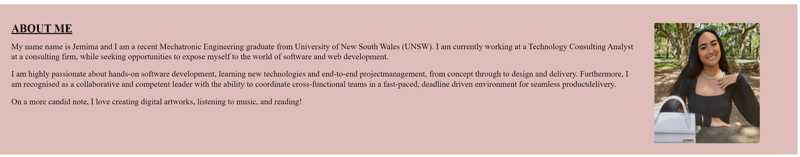

# Portfolio-by-Jemima-Siddiqui

Homework Assignment for Week 2 by Jemima Siddiqui. 

# 02 About the Project - Professional Portfolio

The professional portfolio project consists of a homepage encompassing deployed applications (NOTE: The application links provided are other peoples' work and are used for demonstation purposes ONLY) and work samples for employers. The navigation bar  consists of three options: About me, Work and Contact me. The homepage is fully accessible and ensures that people with disabilities can access the homepage using assistive technologies such as image captions. 


## Acceptance Criteria

The professional portfolio homepage fulfills the following acceptance criteria: 

* Upon loading the portfolio, the user is presented with the developer's name, a recent photo, and links to sections about them, their work, and how to contact them 
* Clicking on links in the navigation bar, the UI scrolls to the corresponding section
* Clicking on the link to the section about work, the UI scrolls to titled images of the developer's applications 
* When presented with the developer's first application, the image of the application enlarges
* Clicking on the image of the application takes the user to the deployed application 
* By resizing the page or viewing the screen on different devices, the layout of adapts to the user's viewport 

## Installation

### Viewing the homepage 

In order to access the professional portfolio homepage, navigate to the following link: 
 [Professional portfolio homepage](https://jemimasiddiqui.github.io/Portfolio-by-Jemima-Siddiqui/). 

### Downloading Visual Studio Code 

 Download the latest version of Visual Studio to your local machine (Mac, Linux or Windows). Please use the following link to download the latest version of VS Code [Download VS Code](https://code.visualstudio.com/download). 

### Pulling the repository from Git 

If you would like to acess the source code (HTML and CSS files) and the images used in the professional portfolio homepage, please navigate to the following public Github repository [Github Repository](https://github.com/JemimaSiddiqui/Portfolio-by-Jemima-Siddiqui.git). 

* Clone the repository to your local desktop using the following steps:

  * 🔑 Use the terminal command `cd` to navigate to the directory where we want the repository located. In this case, we will save it to the Desktop. 

  ```bash
  cd Desktop
  ```

  * 🔑 Use the git command `git clone` followed by the URL copied from Github to clone the repo to our local machine.

  ```bash
  git clone <url>
  ```

  * 🔑 Use the `git clone` command creates a new directory with the same name as the repository. We navigate into our new directory using `cd`.

  ```bash
  cd Portfolio-by-Jemima-Siddiqui
  ```
* After the repository has been cloned to your local machine, open the HTML and CSS files using Visual Studio application. The repository also contains the images used in the professional portfolio homepage. 

## Usage 

This section contains instructions on how to use the professional portfolio homepage. 

1. Navigation bar: 

The navigation bar contains three clickable menu options including: About me, Work and Contact me. Clicking on one of these options causes the UI to scroll to the corresponding section on the homepage.  


2. Aboout me section: 

The About Me section consists of a professional summary of the developer and a recent photo. 



2. Work section: 

The work section consists of a slide bar with images of the developer's deployed applications. NOTE: The application links provided are other peoples' work and are used for demonstation purposes ONLY. Hovering over one of the images causes that image to enlarge. Furthermore, by clicking on the images, users will be redirected to the corresponding deployed application. 


3. Contact me section: 

The contact me section consists of information about how to contact the developer through various social media platforms conveyed through icon images. The platforms include: LinkedIn and and Gmail. This section also consists of a link to the developer's Github repository with source codes of deployed applications. 


3. Accessibility: 

The homepage is fully accessible and ensures that people with disabilities can access a website using assistive technologies such as image captions. 

## Credits

* This README.md file was created through the help of the following tutorial: [Professional README Guide](https://coding-boot-camp.github.io/full-stack/github/professional-readme-guide).
* The application links provided are other peoples' work and are used for demonstation purposes ONLY.

## Main Features

* This webpage consists of the following features: 
  * A navigation bar with three clickable menu options: About me, Work and Contact me.
  * An About me section with a professional summary and recent photo of the developer 
  * A Work section consisting of images that correspond to the developer's deployed applications. Clicking on the images redirects users to the corresponding application. 
  * A contact me section providing links to the developer's professional social media accounts including: LinkedIn, Gmail and GitHub. 
  * Accesbility features to allow people with disability to easily navigate around the homepage. 

---
© 2022 Trilogy Education Services, LLC, a 2U, Inc. brand. Confidential and Proprietary. All Rights Reserved.

